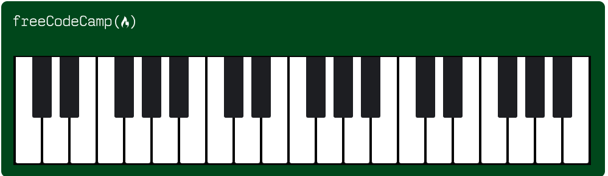

# Learn Responsive Web Design by Building a Piano

The task list link is [FreeCampCode a Balance Sheet](https://www.freecodecamp.org/learn/2022/responsive-web-design/learn-responsive-web-design-by-building-a-piano/step-1)

## Piano Project

Bu proje, farklı ekran boyutlarına uyumlu bir piano tasarımı içerir. Aşağıdaki resimler, proje için kullanılan tasarımları göstermektedir.

### 1199px ve 769px Genişlikteki Görünüm

### 768px'den Daha Küçük Görünüm

## Genel Piano Görünümü

---

#### Dosya Yapısı

- `assets/img/1199px_and_769px_piano.png`: Orta genişlikte ekran tasarımı.
- `assets/img/less_than_768px.png`: Küçük ekran tasarımı.
- `assets/img/Piano.png`: Genel piano tasarımı.

#### Proje Hakkında

Proje, farklı ekran boyutlarına duyarlı (responsive) bir piano tasarımı sunar. Detaylar için görselleri inceleyebilirsiniz.
